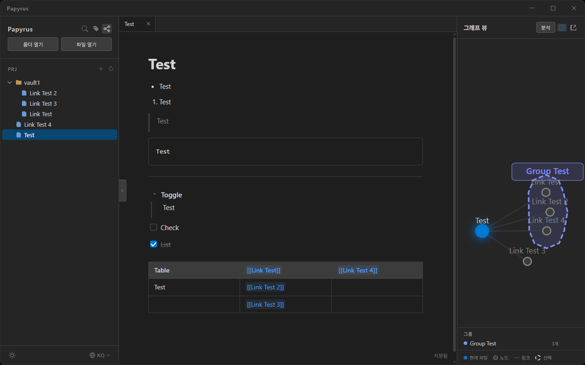

# Papyrus

English | [한국어](./README.ko.md)

> A local Markdown note-taking app inspired by Obsidian



A WYSIWYG Markdown editor that reads and writes local files directly.
Combining Obsidian's Vault concept with Notion's editing experience, Papyrus aims to be a lightweight note app that works out of the box — no account, no sync, just your files.

---

## Features

### Editor
- **WYSIWYG Live Preview** — Edit Markdown as it renders, Notion-style
- **`/` Slash Commands** — Quickly insert headings, lists, code blocks, tables, toggles, and more
- **Toggle Blocks** — Collapsible Notion-style sections
- **Checklists** — To-do lists with nested item support
- **Tables** — Add/remove rows and columns via toolbar, resizable columns
- **Auto Pair** — Auto-closes `[`, `(`, `{`, and `"` as you type
- **Tab System** — Per-file tabs, `Ctrl+S` to save, unsaved indicator (●), close confirmation dialog

### Vault (Folder-based Note Management)
- **Local folder as Vault** — Open any folder to manage all `.md` files inside
- **File Tree** — Browse, create, delete, drag-and-drop move files; rename folders (F2 or double-click)
- **`[[wikilinks]]`** — Navigate between notes; auto-updated when files are renamed
- **`#tags`** — Inline tag highlighting and tag panel
- **Full-text Search** — Search across all files in the Vault

### Graph View
- **D3.js Force Simulation** — Visualize wikilink relationships as a node-edge graph
- **Node Dragging** — Pin nodes in place; positions persist across rebuilds
- **Multi-select** — Click to select, `Ctrl+click` to add, rubber-band drag for range select
- **Groups** — Group selected nodes with a color label
- **Picture-in-Picture** — Open graph in a separate popup window, synced with the sidebar in real time

### More
- **Dark / Light theme**
- **Custom title bar** (Electron only)
- **Firefox not supported** — File System Access API limitation

---

## Tech Stack

| Role | Library |
|------|---------|
| Framework | Vite + React 19 + TypeScript |
| Editor | TipTap v3 (ProseMirror-based) |
| Markdown | tiptap-markdown |
| Graph | D3.js v7 |
| Desktop | Electron 44 + electron-builder |
| File System | File System Access API |

---

## Getting Started

### Development

```bash
# Install dependencies
npm install

# Browser dev server (Chrome recommended)
npm run dev

# Electron dev mode
npm run electron:dev
```

### Build & Release

```bash
# Web build (dist/ folder)
npm run build

# Electron installer build (release/ folder)
npm run electron:build
```

| Platform | Output |
|----------|--------|
| Windows | `Papyrus Setup x.x.x.exe` (NSIS) |
| macOS | `Papyrus-x.x.x.dmg` |
| Linux | `Papyrus-x.x.x.AppImage` |

> **Cross-platform builds**: Each platform must be built on its native OS. Use GitHub Actions to automate all three at once.

---

## Project Structure

```
papyrus/
├── electron/
│   ├── main.cjs        # Electron main process
│   └── preload.cjs     # IPC bridge (minimize / maximize / close)
├── src/
│   ├── components/
│   │   ├── Editor/     # TipTap editor + status bar + table toolbar
│   │   ├── FileTree/   # File/folder tree, drag-and-drop
│   │   ├── GraphView/  # D3 graph (sidebar panel)
│   │   ├── Search/     # Full-text search
│   │   ├── TabBar/     # Tab bar
│   │   ├── TagPanel/   # Tag index panel
│   │   └── TitleBar/   # Custom window chrome
│   ├── extensions/
│   │   ├── Collapsible/        # Toggle block TipTap extension
│   │   ├── SlashCommand/       # / command menu
│   │   ├── AutoPair.ts         # Auto bracket/quote completion
│   │   ├── TagDecorator.ts     # #tag decorator
│   │   └── WikilinkDecorator.ts# [[wikilink]] decorator
│   ├── hooks/
│   │   ├── useVault.ts     # Vault open / file CRUD
│   │   ├── useTabs.ts      # Tab state management
│   │   ├── useGraphData.ts # Wikilink parsing → graph data
│   │   ├── useSearch.ts    # Full-text search
│   │   └── useTagIndex.ts  # Tag index
│   ├── App.tsx         # Root layout, state coordination
│   └── GraphWindow.tsx # PiP graph window
└── public/
    └── icon.png
```

---

## Inspiration

- [Obsidian](https://obsidian.md) — Vault concept, wikilinks, graph view
- [Notion](https://notion.so) — Block-based WYSIWYG editing experience

Papyrus follows Obsidian's philosophy of "your files, your folder" while aiming to be a lighter, faster alternative that works both in the browser and as an Electron app.

---

## License

MIT © 2025
